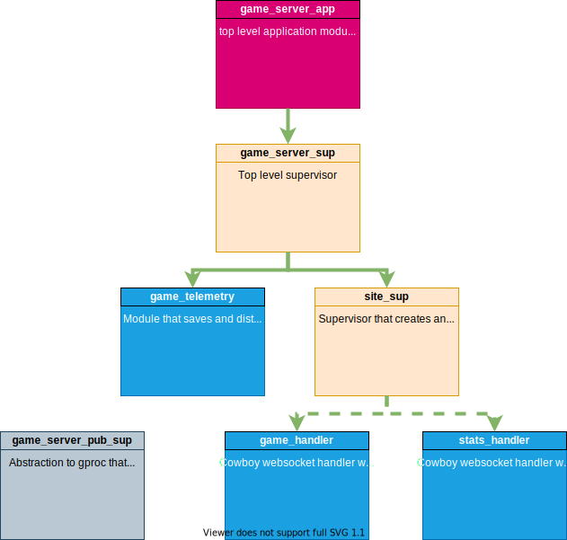

<h1 align='center'>
  GAME SERVER
</h1>

  
  

  

  
<b>Introduction</b>

Welcome to the erlang turned based game server. We use cowboy websocket connections to provide a realtime game server for turn based games. As Godot Game Engine is the best game engine out there (completely unbiased and correct opinion), we have also provided a nice gd script you can place into your game to use the server to hide some of the innerds (WSGameClient.gd). Be sure to let me know if you end up using it! 

  
<b>Design</b>

  

  
<b>Usage</b>

  
This application is fully dockerised, and can be run using the following commands locally.

## Docker build container
docker build -t game_server .

## Docker start container
docker run -d -p 8080:8080 --init game_server

## Docker open shell
docker run -itp 8080:8080 --init game_server sh

